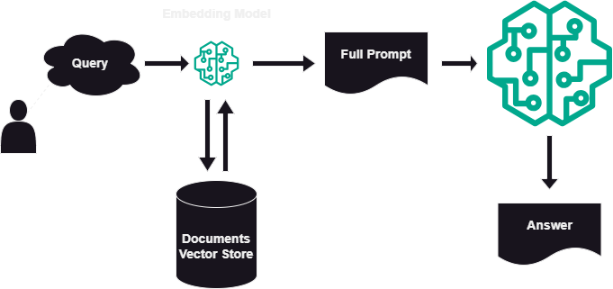
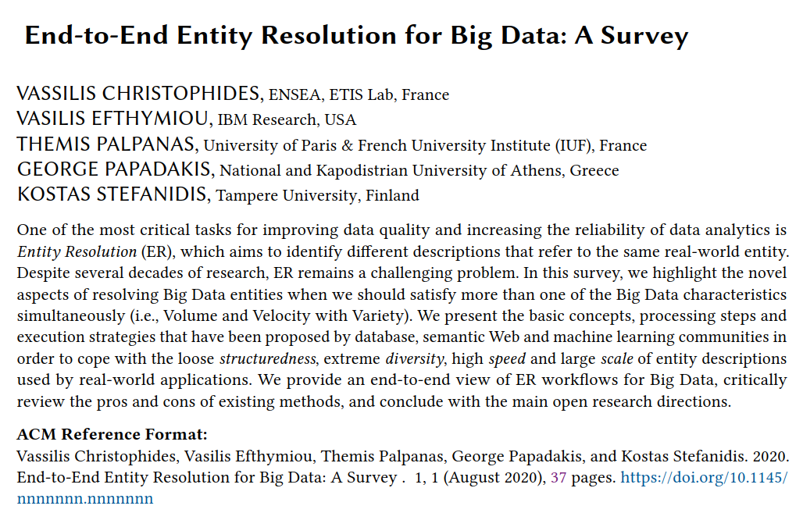
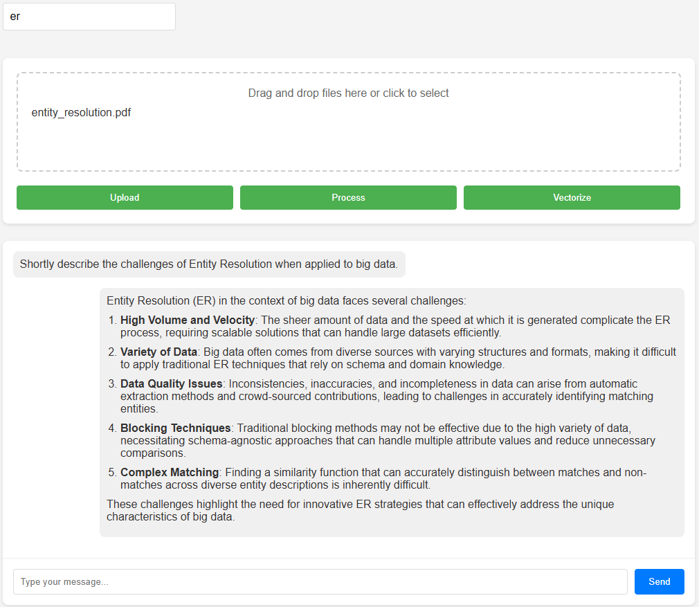
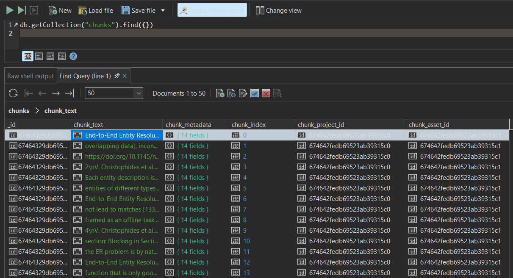

# mini-rag-app

Minimal RAG Application. This is my implementation of the `mini-rag-app` playlist by Eng. Abu Bakr Soliman on [Youtube](https://youtube.com/playlist?list=PLvLvlVqNQGHCUR2p0b8a0QpVjDUg50wQj&si=R1UppbwwmPqejbWI). Original Github repository: [mini-rag](https://github.com/bakrianoo/mini-rag).

## Retrieval-Augmented Generation (RAG)

The aim is to provide additional materials for the user query, which will assist the AI model in generating appropriate responses.



## Setup

This environment is setup to work on a Linux platform. Make sure to use WSL2 on windows.

- Clone this repository.

```bash
git clone https://github.com/e-hossam96/mini-rag-app.git
```

- Install developer tools for C++ package building.

```bash
sudo apt update
sudo apt upgrade -y
sudo apt install build-essential
```

- Download and install Miniconda

```bash
wget https://repo.anaconda.com/miniconda/Miniconda3-latest-Linux-x86_64.sh
bash Miniconda3-latest-Linux-x86_64.sh -b -p ./miniconda
```

- Activate conda `base` environment.

```bash
source ./miniconda/bin/activate
```

- Create **mini-rag** env from [YAML](./environment.yml) file

```bash
cd mini-rag-app/src
conda env create -f environment.yml
conda activate mini-rag
```

- Fill [.env.example](./.env.example) file and save it into a `.env` file. Notice, it is already filled with the default settings except the API keys. Feel free to change them to your preferences.

```bash
cp .env.example .env
```

- Configure **Docker** setups to run **MongoDB** container and deploy the application later.

  - Install `docker`. Details for Linux can be found [here](https://docs.docker.com/engine/install/ubuntu/).
  - Add your `user` to `docker` group by following the steps in [here](https://docs.docker.com/engine/install/linux-postinstall/).
  - Fill [.env.example](./docker/.env.example) file using desired `mongodb` credentials and save it into a `.env` file.

  ```bash
  cp ../docker/.env.example ../docker/.env
  ```

  - Compose the docker services.

  ```bash
  docker compose up -d
  ```

- Run the `FastAPI` server. Use the `--reload` argument only for development. A **Postman** collection is available in the [assets](./assets/mini-rag-app.postman_collection.json) directory for your help.

```bash
uvicorn main:app --reload --host 0.0.0.0 --port 8000
```

## Usage

You can use the exported **Postman** collection provided [here](./src/assets/mini-rag-app.postman_collection.json) and the sample _text_ files to send queries to the different endpoints and evaluate the results.

## Front End

The current front end code contain buttons to send requests to 4 routes out of the six defined so far.

To start the front end server, navigate to to `src/views/` and run the following command.

```bash
python -m http.server 5000
```

This will launch the server on port `5000` which can be accessed using the _URL_ [http://localhost:5000](http://localhost:5000)

Some interactions has been recorded as follows:

- Sample Document (PDF research paper)



- Application Interface



- MongoDB with Text Chunks


